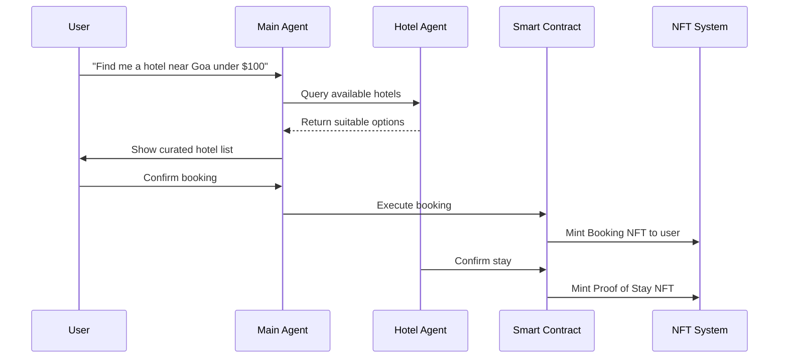

# 🏨 VeriTravel - Decentralized AI-Powered Hotel Booking

[Demo Link](https://your-demo-link.com)

**Autonomous, Transparent, and Intelligent Hotel Booking — Powered by AI Agents and Web3**

---

## 🚀 Overview

**VeriTravel** is a decentralized, AI-powered hotel booking ecosystem that connects users and hotels directly through autonomous agents on the **Hedera network**. It fuses conversational AI, NFT-based booking proofs, and decentralized infrastructure to make travel transparent, verifiable, and fully autonomous.

Unlike centralized booking platforms that act as intermediaries, **VeriTravel** replaces them with on-chain logic and AI agents — enabling **trustless bookings**, **verified stays**, and **NFT-based reputation**.

---

## 🌟 Key Features

* **🤖 AI-Driven Discovery:** Dual-agent system where a *Main Agent* assists users in finding ideal hotels, while *Hotel Agents* (one per hotel) provide real-time data and custom interactions.
* **🪙 NFT Bookings:** Every booking is represented by a **Booking NFT**, ensuring verifiable and transferable proof of reservation.
* **✅ Proof of Stay NFTs:** Upon verified check-out, hotels mint **Proof of Stay NFTs**, allowing only real guests to leave reviews.
* **💬 Agent-to-Agent Communication:** Uses **Hedera toolkit with google A2A** for secure, decentralized coordination between AI agents.
* **📊 Hotel Dashboard:** Manage listings, confirm check-ins, and view booking histories.
* **🌍 User Dashboard:** View all hotels, active bookings, AI chat, and NFT proofs in a single interface.

---

## 💡 Why Web3 over Web2

Web2 booking platforms like Booking.com or Airbnb rely on centralized databases and intermediaries, creating issues like fake reviews, hidden fees, and lack of data ownership.

**DeStay leverages Web3 to fix these problems:**

* **True Ownership:** Users own their bookings as NFTs in their wallets.
* **Trustless Authenticity:** Ratings are only allowed from wallets holding valid **Proof of Stay NFTs**.
* **No Middlemen:** Smart contracts handle transactions directly between user and hotel.
* **Transparent Reputation:** All bookings and reviews are on-chain and verifiable.
* **Global Interoperability:** Integrates easily with DeFi, loyalty NFTs, or decentralized identity frameworks.

Web3 turns opaque booking systems into transparent, user-owned ecosystems — making trust a built-in feature, not a promise.

---

## 🔗 Trust, Identity, and Automation

Every booking, confirmation, and review is validated through **Hedera smart contracts**, ensuring transparent settlement and authenticity. Hotels register their data once, which becomes the knowledge base for their **AI Hotel Agent**, stored securely in **Pinecone** for semantic retrieval.

Each AI Agent operates autonomously:

* The **Main Agent** handles user intents and finds suitable hotels.
* The **Hotel Agent** provides personalized responses and manages bookings.
* **Envio** (HyperIndex) automates event listening for NFT minting and verification.

---

### Core Flow

1. User connects wallet and chats with the **Main Agent**.
2. Main Agent queries relevant **Hotel Agents** for options.
3. Once confirmed, smart contract executes booking and mints **Booking NFT**.
4. Hotel later confirms check-in → mints **Proof of Stay NFT**.
5. User can rate the hotel only if Proof NFT is verified.

---

## ⚙️ Technology Stack

### 🔗 Blockchain & On-Chain Components

* **Hedera Hashgraph & AgentKit:** Primary network for NFT minting, booking, and proof validation.
* **Envio:** Event indexing and on-chain automation.
* **Smart Contracts:** Handle booking logic, NFT minting, and settlement.

### 🧠 AI & Data Layer

* **LangChain:** Multi-agent orchestration for Main and Hotel Agents.
* **Pinecone:** Vector storage for hotel data and embeddings.
* **LLMs:** Power contextual chat, personalization, and negotiation.

### 💻 Frontend

* **React + Tailwind:** User-friendly and modern interface.
* **Wallet Integration:** Hedera-compatible wallet connection.
* **Real-time Chat:** AI-driven booking and payment support.

---

## 🧱 Core Components

### 1️⃣ User Dashboard

* Connect wallet and interact with AI.
* Browse and filter hotels.
* Manage active bookings.
* View NFTs (Booking + Proof of Stay).
* Chat with hotel-specific AI agents.

### 2️⃣ Hotel Dashboard

* Register and manage hotel data.
* Review booking histories.
* Confirm stays and mint Proof NFTs.
* View on-chain reputation.

---

## 🧰 How It Works

---

## 🔒 Security & Authenticity

* **Smart Contract Security:** All booking logic verified on-chain.
* **NFT-based Access Control:** Only Proof holders can rate.
* **Liveness Checks:** AI validation ensures stay confirmations are authentic.
* **Immutable Reviews:** Stored permanently and transparently on Hedera.

---

## 🌍 Impact & Why It Matters

The hospitality industry depends heavily on centralized intermediaries that charge high fees and control access to customer data. **DeStay removes these barriers** by letting users and hotels interact directly — with **AI for personalization** and **Web3 for trust**.

This enables:

* Real ownership of travel credentials.
* Authentic, verifiable reviews.
* Low-cost transactions and bookings.
* A transparent, fair, global travel ecosystem.

---

## 🛠️ How It’s Made

* **AI Orchestration:** LangChain-based multi-agent system.
* **Blockchain Logic:** Smart contracts on Hedera for NFT minting and escrow.
* **Automation:** Envio for event-based NFT issuance.
* **Frontend:** React dashboard for unified booking and management.
* **Data Layer:** Pinecone embeddings for semantic hotel search.

---

## 🚀 Future Scope

* **Loyalty NFTs:** Reward frequent travelers and verified stays.
* **AI Travel Layer:** Integrate flights, events, and transport under one ecosystem.
* **DAO Governance:** Hotel and user community-led reputation and listings.
* **Cross-chain Interoperability:** Expand beyond Hedera for global reach.

---

## 🙏 Acknowledgments

* **Hedera Hashgraph and AgentKit** for decentralized infrastructure.
* **LangChain & Pinecone** for enabling powerful AI orchestration.
* **Envio (HyperIndex)** for seamless on-chain event automation.
* **ETHOnline Hackathon** for the platform to build and share innovation.
* **Google A2A** for communication between agents.

---

**🏨 VeriTravel — Where AI Agents Meet Decentralized Travel.**
*Built with ❤️ for ETHOnline 2025*

