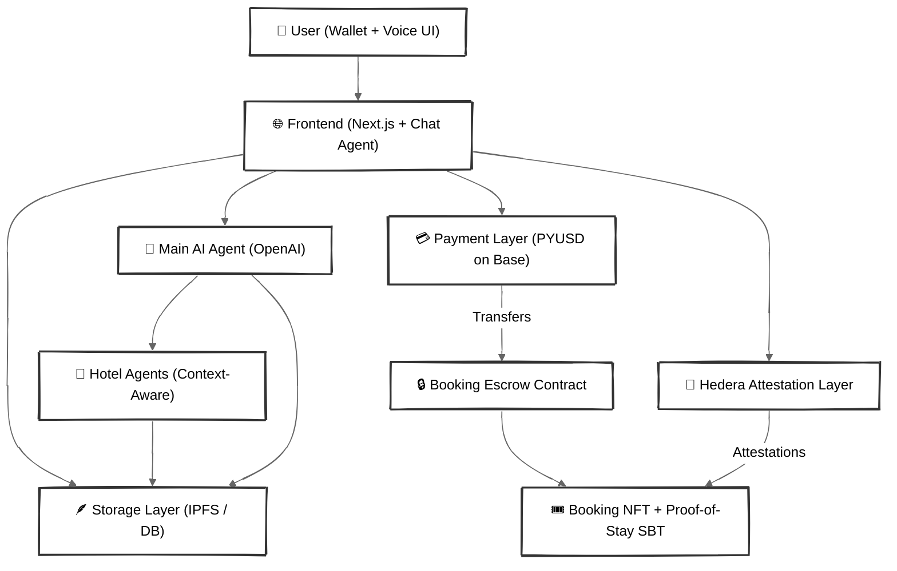
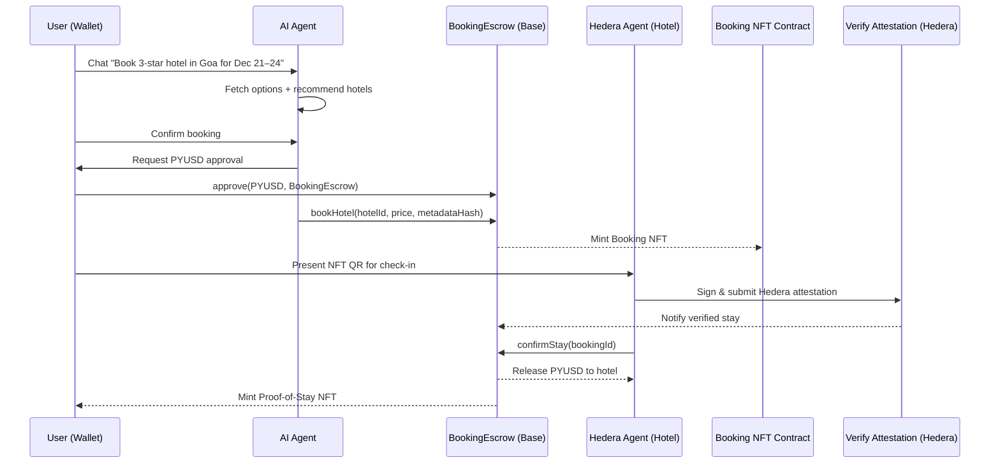

# VeriTravel — AI-Powered Web3 Hotel Booking & Verification Platform

<p align="center">
  
</p>

[](LICENSE)


---

## 🧭 Overview

**VeriTravel** is a **Web3-integrated, AI-powered hotel booking and verification platform** that uses **AI agents**, **Hedera attestations**, and **on-chain payments** to provide secure, transparent, and verifiable stays.

The platform leverages **OpenAI-powered conversational booking**, **Base blockchain (PYUSD)** for escrowed payments, and **Hedera Agent Kit** for check-in attestations — ensuring **trustless verification**, **proof-of-stay NFTs**, and **AI-driven personalization**.

> 💡 “Where AI meets trust — every stay, verified.”

---

## 🧱 System Architecture Overview



---

## 🧩 Key Smart Contracts & Agents

| Component                 | Responsibility                                                   | Network |
| ------------------------- | ---------------------------------------------------------------- | ------- |
| **HotelRegistry**         | Registers hotels with metadata & IPFS snapshot.                  | Base    |
| **BookingEscrow**         | Holds PYUSD payments until checkout verification.                | Base    |
| **BookingNFT / ProofSBT** | Issues booking & proof-of-stay NFTs to guests.                   | Base    |
| **AttestationService**    | Logs Hedera attestations for verified check-ins.                 | Hedera  |
| **Main AI Agent**         | Conversational booking, price comparison, and query routing.     | Server  |
| **Hotel Agents**          | Hotel-specific AI agents trained on hotel data & policy context. | Server  |

---

## 🔄 Booking Lifecycle (Simplified Flow)

1. **Hotel Registration**

   * Hotel connects wallet → registers via smart contract → uploads metadata & policies → stored on IPFS.

2. **User Discovery**

   * User connects wallet → interacts with AI chat/voice assistant.
   * AI retrieves hotel listings from TheGraph/DB & recommends options.

3. **Booking & Payment**

   * User approves PYUSD (one-time allowance).
   * AI agent confirms price snapshot and executes `bookHotel()` on BookingEscrow.
   * Booking NFT minted with snapshot details.

4. **Check-in Verification**

   * Hotel verifies NFT ownership.
   * Hedera Agent Kit logs check-in attestation signed by hotel.
   * Booking status updated onchain to `CHECKED_IN`.

5. **Checkout & Proof of Stay**

   * Hotel calls `confirmStay()` → escrow releases payment.
   * Proof-of-Stay NFT minted (SBT style).
   * Review unlocked post-stay.

---

## 🔐 Security & Trust Model

* **Escrow Protection:** Funds locked until verified stay completion.
* **Hedera Attestations:** Immutable proofs for check-in events.
* **AI Transparency:** Logs agent decisions; user can revoke session keys.
* **Session-limited Allowance:** Scoped, time-bound PYUSD approvals.
* **Price Snapshots:** Each booking stores price and metadata hash.

---

## 🧬 Sequence Diagram (Core Flow)



---

## ⚙️ Tech Stack

| Category            | Technology                                    |
| ------------------- | --------------------------------------------- |
| **Frontend**        | Next.js 15, React 19, TailwindCSS, ShadCN/UI  |
| **AI Layer**        | OpenAI GPT, Contextual Retrieval, LangChain   |
| **Blockchain (L1)** | Base (Escrow + Booking NFTs + PYUSD Payments) |
| **Verification L2** | Hedera Hashgraph (Agent Kit, Attestations)    |
| **Smart Contracts** | Solidity + Foundry                            |
| **Storage**         | IPFS + PostgreSQL                             |
| **Indexing**        | Envio / TheGraph                              |
| **Deployment**      | Docker, Vercel (Frontend), Render (Backend)   |

---

## 🧰 Folder Structure

```
```

---

## ⚙️ Setup & Installation

### 1️⃣ Clone Repository

```bash
git clone https://github.com/appajidheeraj/veritravel.git
cd veritravel
```

### 2️⃣ Install Dependencies

```bash
cd apps/frontend && npm install
cd ../../services/ai-agent && npm install
```

### 3️⃣ Environment Configuration

Create `.env` files for each service:

```bash
OPENAI_API_KEY=sk-xxxx
BASE_RPC_URL=https://base-mainnet.infura.io/v3/xxxx
HEDERA_ACCOUNT_ID=0.0.xxxx
HEDERA_PRIVATE_KEY=302e0201...
PYUSD_TOKEN_ADDRESS=0x...
```

### 4️⃣ Start Services

```bash
npm run dev        # Frontend
nodemon server.js  # Each backend microservice
```

---

## 🧾 Data Flow Diagram

```
User ─▶ Chat UI ─▶ AI Agent ─▶ Escrow Contract ─▶ NFT Mint ─▶ Hedera Attestation
                                                  │
                                                  ▼
                                             Proof-of-Stay NFT
```

---

## 💬 Demo Script (2-Minute Flow)

1. Hotel connects wallet → registers on dashboard → uploads policy files.
2. User asks: “Book me a 3-star hotel in Goa for Dec 21–24 under $100.”
3. AI displays 3 hotel options with prices → user selects one.
4. User approves PYUSD → AI executes booking → Booking NFT minted.
5. User shows NFT QR on arrival → hotel verifies via Hedera → check-in verified.
6. After checkout → PYUSD released → Proof-of-Stay NFT minted.
7. User leaves review (allowed only if proof NFT exists).

---

## 🔮 Roadmap

* [ ] **Multi-chain support (Base + Hedera dual)**
* [ ] **AI voice booking assistant (VeriVoice)**
* [ ] **Dynamic pricing based on occupancy data**
* [ ] **DAO-powered dispute & review system**
* [ ] **Hotel-level analytics & NFT-based loyalty system**

---

## 👨‍💻 Author

> Building verifiable, AI-driven Web3 experiences 🌍✨


---

## 📜 License

This project is licensed under the **MIT License**.

---

⭐ **If VeriTravel inspires you, give it a star and join the journey toward verifiable travel!**
